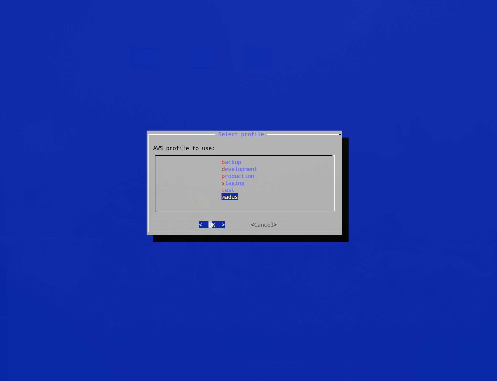
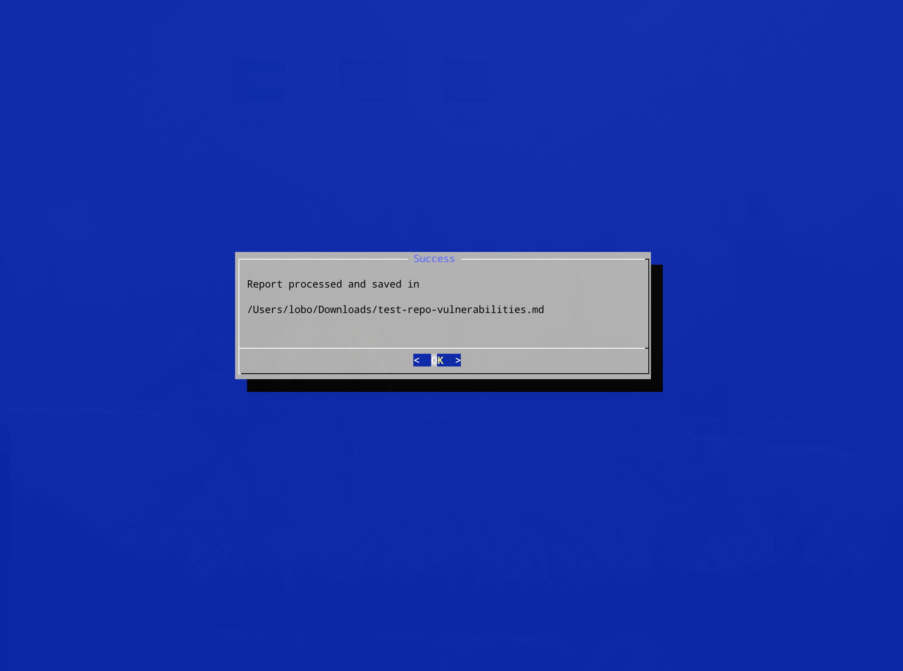
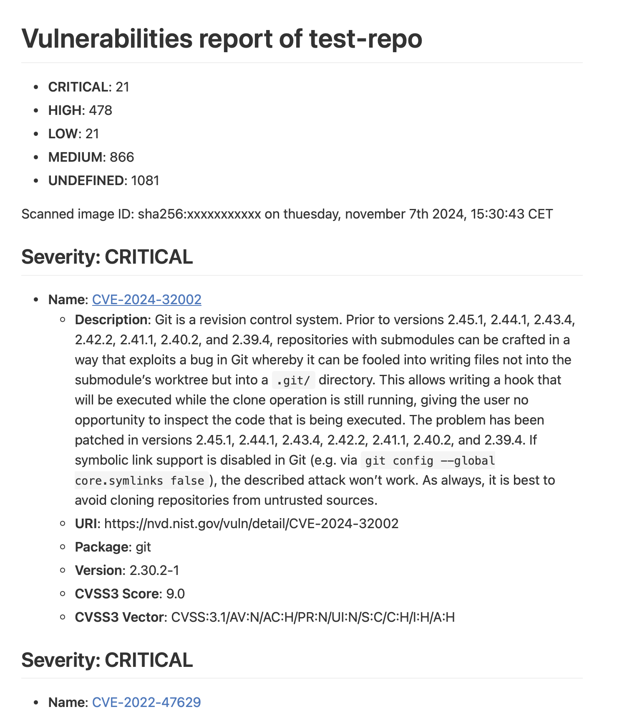

# aws-ecr-get-image-scan-report
Script para descargar el json de los informes de vulnerabilidades de imágenes en AWS ECR y generar un informe en Markdown.

El script está escrito para que funcione en macOS y utilice whiptail para mostrar un entorno gráfico noventero.

## ¿Qué hace esto?
En tiempo de ejecución, pregunta por el repositorio que contiene la imagen de la que se va a descargar el informe.

Después, lee los profiles de AWS existentes en ~/.aws/config y los presenta en una lista para elegir el que se necesite.

A continuación, busca la última imagen almacenada en el repositorio dado y descarga su informe en `json`, y lo parsea.

Finalmente, lo guarda en ~/Downloads con el nombre del repositorio indicado, junto con su identificador y la fecha dentro del informe.

El resultado será algo como esto:

Lo de enviarle el informe a tus developers y darles con un palo para que arreglen las vulnerabilidades, ya es un proceso más manual ;)

## To do
Seguramente haya que capturar mejor los errores, por ejemplo en caso de que no haya imágenes con informe de escaneo.

Probablemente se podría también listar todos los repositorios en ECR de una cuenta de AWS dada según el profile y darlos a elegir.

Pero ya sabéis: `en mi máquina funciona`.

========================================================

# aws-ecr-get-image-scan-report
Thii script download the JSON of vulnerability reports for images in AWS ECR and generate a report in Markdown language.

The script is written to work on macOS and uses whiptail to display a retro graphical environment.

## What does this do?
It asks for the repository containing the image from which the report will be downloaded.

Then, it reads the existing AWS profiles in ~/.aws/config and presents them in a list to choose the one needed.

Next, it searches for the latest image stored in the given repository and downloads its report in json format, and parses it.

Finally, it saves it in ~/Downloads with the name of the given repository, along with its identifier and the date within the report.

The result will look something like this:

Sending the report to your developers and poking them with a stick to fix the vulnerabilities is a more manual process ;)

##To do
Error handling probably needs to be improved, for example in case there are no images with scan reports.

It could also potentially list all ECR repositories in a given AWS account according to the profile and offer them for selection.

But you know: `it works on my machine`.